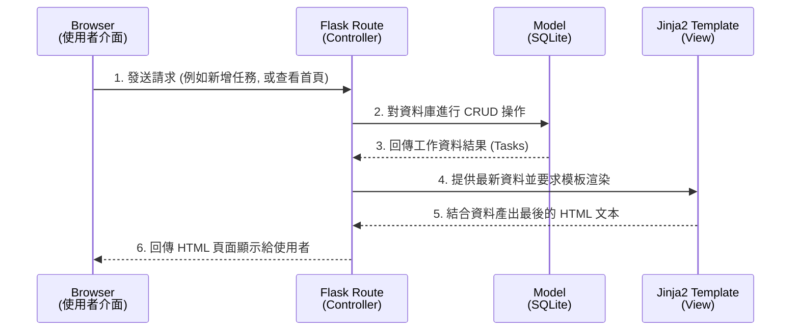

# 系統架構設計 (Architecture) - 工作管理系統

## 1. 技術架構說明

本系統為一個輕量級的 Web 應用程式，專為個人任務管理設計。主要的技術選型如下：

- **後端框架：Python + Flask**
  - **選用原因**：Flask 是一套輕量、靈活的微框架（Micro-framework），非常適合用來快速打造像工作管理系統這樣的小型 Web 應用，能夠大幅降低開發阻力。
- **模板引擎：Jinja2**
  - **選用原因**：Jinja2 是 Flask 預設搭配的模板引擎，能將後端傳遞過來的資料動態渲染為 HTML。我們不採用前後端分離的架構（如 React/Vue + API 等單頁應用程式），而是由 Flask 與 Jinja2 在伺服器端把畫面組合好再回傳給瀏覽器，如此使得系統架構單純且極易維護。
- **資料庫：SQLite**
  - **選用原因**：由於目標是用於個人的日常工作管理，資料量極少（預期為數千筆以內）。SQLite 是一個內建在單一檔案中的關聯式資料庫，不需要額外架設與維護複雜的資料庫伺服器，部署與開發都極為方便。
- **架構設計模式：基於 MVC (Model-View-Controller) 概念**
  - **Model (模型)**：負責定義資料的結構與操作邏輯（對應到資料庫中的工作清單資料表）。
  - **View (視圖)**：負責呈現使用者介面（透過 Jinja2 組合與渲染出的 HTML 頁面）。
  - **Controller (控制器)**：負責接收使用者的請求，呼叫 Model 取得或更新資料，然後把資料交給 View 去渲染（對應到 Flask 的 Routes 以及處理函數）。

## 2. 專案資料夾結構

為了保持程式碼的可維護性，建議將不同職責的檔案分門別類，採用的資料夾結構如下：

```text
web_app_development/
├── docs/                      ← 放置所有開發技術相關文件 (如 PRD.md, ARCHITECTURE.md 等)
├── app/                       ← 應用程式的主要程式碼目錄
│   ├── __init__.py            ← 初始化 Flask App、載入設定與初始化資料庫
│   ├── models.py              ← 資料庫模型宣告 (工作任務資料表)
│   ├── routes.py              ← Flask 路由 (定義 URL 與對應的畫面邏輯)
│   ├── templates/             ← Jinja2 HTML 模板資料夾 (View)
│   │   ├── base.html          ← 共用的 HTML 骨架 (包含 Navbar、引入 CSS/JS)
│   │   ├── index.html         ← 工作清單主頁面
│   │   └── calendar.html      ← 行事曆視圖頁面
│   └── static/                ← 靜態資源資料夾
│       ├── css/
│       │   └── style.css      ← 自定義樣式表
│       └── js/
│           └── script.js      ← 前端互動邏輯 (如打勾完成時的 Ajax 行為)
├── instance/                  ← 存放運行時期動態生成的檔案 (不應進入 Git 版本控制)
│   └── database.db            ← SQLite 資料庫檔案實體
├── run.py                     ← 啟動 Flask 應用程式伺服器的入口檔案
├── requirements.txt           ← 專案依賴的 Python 套件清單 (如 flask)
└── README.md                  ← 專案設定與服務啟動說明文件
```

## 3. 元件關係圖

以下展示專案中各個系統元件的請求與資料流動：



## 4. 關鍵設計決策

1. **採用伺服器端渲染 (Server-Side Rendering, SSR)**
   - **考量點**：對於一個 MVP 階段的工作管理應用來說，核心功能是快速且正確地進行增刪改查。
   - **決定**：使用 Flask 路由加上 Jinja2 作為介面渲染方案。少量需要不重新載入頁面的操作（例如切換任務完成狀態）可透過原生 Fetch API 搭配 Flask 的小支 API 實作。這有效減少了系統複雜度。
2. **資料庫檔案安全性考量**
   - **考量點**：開發時，資料庫常常會連同敏感資料一起不小心被上傳到公開的程式庫。
   - **決定**：遵循 Flask 的官方最佳實踐，將 SQLite 檔案放置於專案根目錄的 `instance/` 資料夾內，確保該資料夾已加入 `.gitignore` 排除清單中，以防外流風險。
3. **任務狀態的篩選實現方式**
   - **考量點**：在首頁切換「全部」、「已完成」、「未完成」時的體驗。
   - **決定**：作為初步版本，將會使用 URL query 參數（例如 `/?status=completed`）讓後端讀取並返回篩選後的資料頁面。相較於前端篩選，此做法更具備可擴展的資料串接能力。
