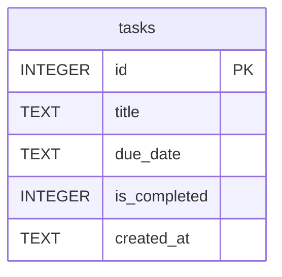

# 資料庫設計文件 (DB Design) - 工作管理系統

## 1. ER 圖（實體關係圖）



## 2. 資料表詳細說明

### `tasks` (工作清單)

儲存使用者的日常待辦事項。

| 欄位名稱 | 型別 | 必填 | 預設值 | 說明 |
| :--- | :--- | :--- | :--- | :--- |
| `id` | INTEGER | 是 | (AUTOINCREMENT) | Primary Key，唯一識別碼 |
| `title` | TEXT | 是 | - | 任務的標題 / 名稱 |
| `due_date` | TEXT | 否 | NULL | 預期完成日期（格式建議使用 `YYYY-MM-DD`） |
| `is_completed` | INTEGER | 是 | `0` | 完成狀態，`0` 代表未完成，`1` 代表已完成 |
| `created_at` | TEXT | 是 | `CURRENT_TIMESTAMP` | 任務建立的時間戳記 (ISO 格式) |

## 3. SQL 建表語法

建立資料庫的語法存放於 `database/schema.sql` 中，完整語法如下：

```sql
CREATE TABLE IF NOT EXISTS tasks (
    id INTEGER PRIMARY KEY AUTOINCREMENT,
    title TEXT NOT NULL,
    due_date TEXT,
    is_completed INTEGER NOT NULL DEFAULT 0,
    created_at TEXT NOT NULL DEFAULT CURRENT_TIMESTAMP
);
```

## 4. Python Model 程式碼

針對 `tasks` 資料表，我們實作了 Python Model 處理 CRUD 相關邏輯。
採用內建的 `sqlite3` 套件來執行資料庫操作。此部分程式碼已經置於 `app/models/task.py`。
包含的方法有：
- `create`: 建立新工作
- `get_all`: 取得所有工作清單（支援未完成/已完成的篩選）
- `get_by_id`: 依 ID 取得單一工作
- `update`: 更新任務標題或完成日期
- `delete`: 刪除任務
- `toggle_status`: 切換任務的完成狀態
