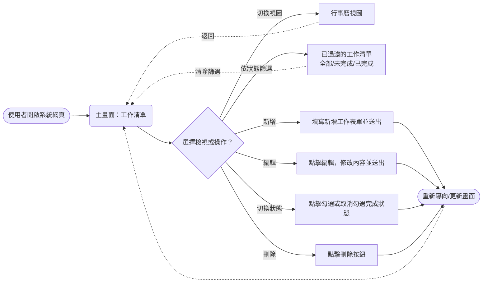
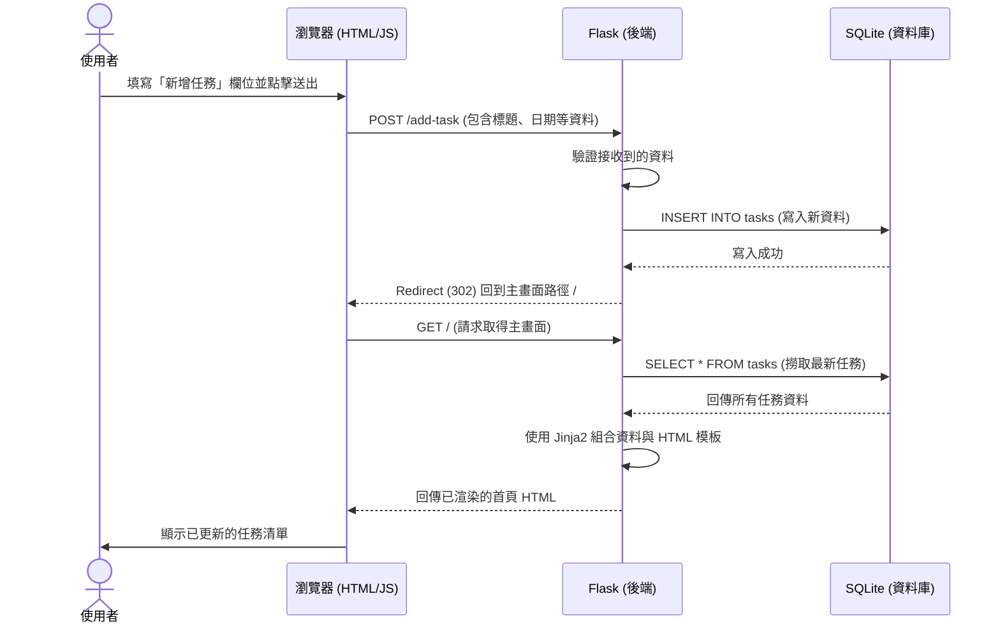

# 流程圖與路徑設計 (Flowchart) - 工作管理系統

## 1. 使用者流程圖（User Flow）

這張圖展示了使用者進入系統後，所有可能的操作與路線：

## 2. 系統序列圖（Sequence Diagram）

這張圖透過「新增工作」的範例，說明了前、後端與資料庫之間是如何互動。

## 3. 功能清單對照表

以下整理了系統中所有主要功能的存取路徑，對應的 HTTP 方法，以及該行為執行的目的。這個對照表有助於接下來建立 Flask 的路由。

| 功能項目 | 路徑 (URL Endpoint) | HTTP 請求方法 | 說明 |
| --- | --- | --- | --- |
| **首頁/目前清單** | `/` | `GET` | 顯示所有或根據 GET 參數（如 `?status=done`）篩選過的工作清單 |
| **行事曆視圖** | `/calendar` | `GET` | 顯示行事曆介面的工作排程 |
| **新增工作** | `/add` | `POST` | 接收表單提交資料建立新工作，完成後重導向回首頁 |
| **編輯工作** | `/edit/<task_id>` | `POST` | 接收表單提交資料更新指定工作，完成後重導向回首頁 |
| **切換完成狀態** | `/toggle/<task_id>` | `POST` | 將指定任務切換為「完成」或「未完成」，完成後重導向回首頁 |
| **刪除工作** | `/delete/<task_id>` | `POST` | 刪除與 URL 參數對應的指定任務，完成後重導向回首頁 |

> 註：在不依賴進階前端框架下（全後端渲染），編輯、切換狀態及刪除皆建議使用 `POST` 方法搭配網頁表單發送，可避免瀏覽器對 HTTP PUT 或 DELETE 方法支援程度的問題。
